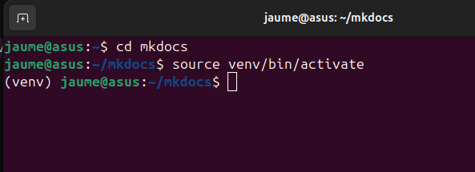
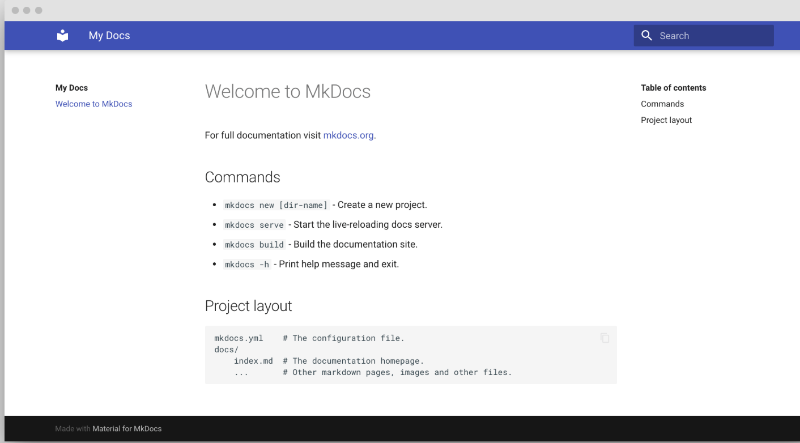

# Requisits i instal.lació

Abans de començar a construir amb MkDocs, cal preparar el sistema.

---

## 1 Verificar els Prerequisits

Per poder utilitzar MkDocs, necessitaràs tenir instal·lades un parell d'eines bàsiques al teu equip:

* P**ython:** Versió 3.7 o superior (MkDocs va deixar de suportar Python 2). Executa python --version al vostre terminal. Si falta o està obsolet, descarregueu-lo des de python.org. A Windows, assegureu-vos que Python s’afegeixi a la vostra PATH durant la instal·lació; comproveu la casella de l’instal·lador.

* **pip:** El gestor de paquets Python, normalment inclòs amb Python 3.4+. Comproveu amb pip --version. Si falta, descarregueu get-pip.py des del web i funciona python get-pip.py.

* **Git:** Opcional per al desplegament a les pàgines de GitHub. Comproveu amb git --version. Instal·leu-lo des de git-scm.com, si cal.

## 2 Instal.lació 

* Creeu una carpeta del projecte: Mantenim les coses organitzades creant una carpeta dedicada al vostre projecte MkDocs:

```bash

mkdir mkdocs
cd mkdocs

```

* Aquesta carpeta contindrà els fitxers MkDocs i cd et mou dins, a punt per a l’acció.

* Configura un entorn virtual: Per evitar conflictes de paquets, creeu un entorn virtual Python:

```bash

python -m venv venv

```

* Activa-ho a Linux:

```bash

source venv/bin/activate

```

Veureu (venv) al vostre terminal, cosa que significa que esteu en un entorn Python net. Això aïlla les dependències de MkDocs, mantenint el vostre sistema organitzat.



## 3 Instal·lació de MkDocs

* Ara, instal·lem MkDocs i prepareu-lo per crear la vostra documentació de l’API. Això és ràpid i fàcil.

* Instal·leu MkDocs: Amb el vostre entorn virtual actiu, executeu:

```bash

pip install mkdocs

```

* Pot trigar un moment a descarregar dependències com Markdown i Pyments.

* Comproveu que  MkDocs està instal·lat correctament:

```bash

mkdocs --version

```


* Hauríeu de veure alguna cosa com mkdocs, version 1.6.1 (o més recent). 

* Instal·leu un tema.  
* El tema Material per a MkDocs és el favorit per al seu aspecte modern. Instal·leu-lo:

```bash 

pip install mkdocs-material

```

## 4 Creació i ús del vostre projecte MkDocs


Inicialitzeu un nou projecte: A la vostra carpeta mkdocs(amb l’entorn virtual actiu) i creeu un nou projecte MkDocs:

```bash 

mkdocs new .

```


Això crea:

* **mkdocs.yml:** El fitxer de configuració del vostre lloc.

* **docs/:** Una carpeta amb un fitxer index.md, la pàgina principal predeterminada. La carpeta docs/ és on van els fitxers Markdown i index.md és el punt d’entrada del vostre lloc.

``` {..sh .no-copy}
.
├─ documents /
│ └─ index.md
└─ mkdocs.ymml

```

## 5 Configuració mínima


Afegiu les línies següents mkdocs.yml habilitar el tema:


``` yaml

site_name: My site
site_url: https://mydomain.org/mysite
theme:
  name: material

```

* Establir el **"site_url"** és important per diverses raons. De manera predeterminada, MkDocs assumirà que el vostre lloc està allotjat a l’arrel del vostre domini. Si no és així, per exemple, quan publiquem a les pàgines GitHub o a un altre servidor cal declarar-ho aquí.


## 6 Previsualització mentre s'escriu

MkDocs inclou un servidor de previsualització en directe, de manera que podeu previsualitzar els vostres canvis a mesura que escriviu la vostra documentació. El servidor reconstruirà automàticament el lloc en desar. Comença-ho amb:

```bash

mkdocs serve --livereload 

```

Assenyala el navegador a local al port 8000  http://localhost:8000 i hauríeu de veure:



## Publicar la carpeta al meu VPS (nginx)

Quan acabeu d’editar, podeu crear un lloc estàtic dels fitxers Markdown amb:

```bash

mkdocs build

```

* Això crea la carpeta site dins del projecte. 


!!! nota "Site"

    El contingut d’aquest directori compon la documentació del vostre projecte. No cal operar una base de dades ni un servidor, ja que està completament autònoma. El lloc es pot allotjar Pàgines GitHub, Pàgines GitLab, un CDN que escolliu o el vostre espai web privat.